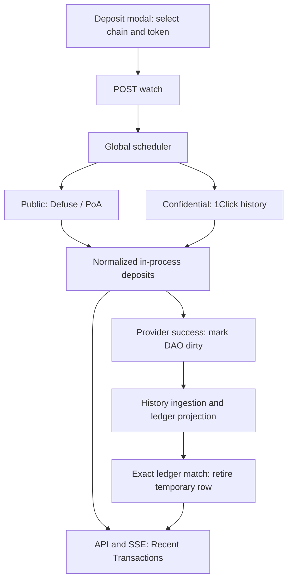

# Trezu Global Deposit Tracker Plan

## 1. Goal

Build one backend deposit tracker with two provider paths: public treasuries use the Defuse/PoA deposit interface, and confidential treasuries use authenticated 1Click history. Both return the same frontend deposit model.

The tracker starts when a user opens the deposit modal and selects a chain and token. It polls frequently for the first 10 minutes, slows down afterward, and eventually stops discovery if no deposit appears. Once a deposit is detected, tracking continues until the provider reports a terminal outcome.

Detected deposits appear in Recent Transactions using a separate in-process API. Successful provider settlement marks the DAO dirty and triggers history ingestion. The temporary deposit is removed only after the permanent ledger contains the corresponding deposit.

**Ownership:** the tracker owns temporary deposit progress; the ledger owns permanent transaction history.

This document captures the agreed architecture. Provider endpoint names, status meanings, uniqueness rules, and correlation fields must be validated against the installed SDK and actual responses before implementation. References to the existing confidential flow come from the preceding discussion, rather than a fresh repository inspection.

## 2. Architecture



Use one scheduler with bounded concurrency and separate rate limits for each provider. Public polling is grouped by Intents account; confidential polling is grouped by quote session. Do not spawn a permanent worker for every address or modal opening.

## 3. Frontend activation

After selecting a chain and token and obtaining the deposit address, the frontend calls:

```http
POST /api/treasuries/:treasuryId/deposit-watches
Idempotency-Key: <client-generated-key>
```

Public request:

```json
{
  "chain": "eth:8453",
  "tokenId": "<selected-token-id>"
}
```

Confidential request:

```json
{
  "chain": "eth:8453",
  "tokenId": "<selected-token-id>",
  "depositSessionId": "<backend-generated-session-id>"
}
```

The backend determines the treasury type, resolves the correct Intents account or confidential quote, and verifies authorization. Do not trust a client-supplied treasury type, account ID, quote address, or confidential JWT.

The confidential address-generation endpoint persists the quote session before returning the address. The watch POST activates or extends that session's polling window. This avoids losing the association between the address and treasury.

Repeated requests reuse the same public watch scope or confidential session. Reopening the modal renews the fast window to `now + 10 minutes`, within configured limits. Closing the modal does not cancel tracking: the user may copy the address, close the modal, and send afterward.

## 4. Polling lifecycle

Suggested starting intervals, subject to provider quotas:

| Time since activation or renewal | Discovery interval |
| --- | --- |
| 0–10 minutes | Every 5 seconds |
| 10–30 minutes | Every 30 seconds |
| 30–120 minutes | Every 2 minutes |
| After 120 minutes, with no detected deposit | Stop active discovery |

Add approximately 0–20% jitter. Keep `fast_until`, `discovery_until`, and `next_poll_at` in Postgres so restarts preserve the schedule.

Two lifecycles must remain separate:

- **Discovery watch:** expires if nothing has appeared. Expiry means Trezu stopped watching; it does not prove an address can no longer receive money.
- **Detected deposit:** continues tracking independently of the discovery window. A timeout or provider outage does not turn a known deposit into `FAILED`.

For detected deposits, start with a 5–10 second refresh interval, then use capped backoff for errors or long settlement delays. Alert on deposits stuck beyond a provider-specific threshold and keep slower reconciliation running.

Deposits sent to reusable public addresses after discovery stops can be absent from this temporary UX tracker. Normal public history ingestion must still discover completed deposits independently. If pre-settlement visibility is required for every deposit at all times, add background account discovery or a provider event feed.

Confidential quote expiry must use provider-defined rules. If an unfunded session reaches its funding deadline, perform a final check and any required grace-period reconciliation before retiring its watch. Never abandon a detected deposit solely because its quote deadline passed.

## 5. Public treasury mechanism

### Tracking identity

Poll the **Intents account associated with the treasury**, which may need an explicit mapping rather than assuming it always equals the DAO ID. Deposit addresses are reusable metadata; they are not separate polling jobs.

### Flow

1. The user selects a chain and token and activates a public watch.
2. The scheduler groups active watches for the same Intents account into one provider request.
3. The public adapter calls the Defuse SDK's supported deposit method backed by `recent_deposits(account_id, ...)`.
4. It paginates sufficiently to avoid missing deposits during busy periods and filters results for the relevant watch scopes.
5. For each new provider deposit, it creates or updates a separate `in_process_deposits` row.
6. Once the provider supplies the evidence required by Trezu's detection rule, the deposit becomes `DETECTED`. The backend sends SSE invalidation and the UI shows the amount and chain.
7. Pending provider states remain in progress. Confirmed provider success becomes `FINALIZED`.
8. Finalization atomically enqueues a public history refresh. The tracker retains the temporary row until the ledger match is committed.

One watch may discover several deposits, including several transfers of the same token. Create one deposit row per actual provider deposit.

### Deduplication and old results

Prefer a stable provider deposit ID. If none exists, use the complete transaction identity: chain, source transaction hash, and event/output index where applicable. `(chain, tx_hash)` alone is safe only if the provider guarantees one relevant deposit per transaction; a transaction can otherwise contain multiple transfers or outputs.

Store a watch baseline or activation timestamp with an overlap window. Check provider identity against existing tracker records and ledger correlations so old completed deposits returned by the recent-history endpoint do not appear as new processing rows. Do not rely solely on offset pagination remaining stable while new results arrive.

### Status normalization

Keep the raw provider status alongside the generic state. Treat names such as `PENDING`, `CREDITED`, and `COMPLETED` as candidates to validate, rather than an established contract. Only map a status to `FINALIZED` after confirming that it means successful settlement to the intended destination. Unknown statuses remain unresolved and generate diagnostics.

## 6. Confidential treasury mechanism

### Tracking identity

The confidential flow uses a backend-owned quote session with two addresses:

| Field | Purpose |
| --- | --- |
| `origin_deposit_address` | Origin-chain address shown to the user |
| `quote_deposit_address` | 1Click quote identifier used for history lookup |

Persist both addresses, the owning treasury, chain, token, and provider deadline when generating the address. The selected approach assumes the one-time quote flow discussed earlier; verify it against the current backend.

### Flow

1. The backend creates the confidential quote and origin-chain address.
2. It stores a confidential session before returning the address.
3. The frontend activates the session through the watch POST.
4. The confidential adapter obtains the DAO's JWT through the backend credential store.
5. It queries the authenticated history flow using the quote deposit address, conceptually `/v0/account/history?depositAddress=<quote_deposit_address>`.
6. No matching record means no deposit evidence yet. A record's existence alone must not be treated as proof of origin-chain confirmation.
7. When the response contains actual deposit evidence, normalize it to `DETECTED`, store available amount and identifiers, and notify the UI.
8. Continue reading provider progress until authenticated settlement history reports terminal success.
9. Set `FINALIZED` and atomically enqueue confidential history ingestion.
10. Retire the temporary row after the corresponding confidential ledger event is committed.

Confidential queries use the quote/session identity, rather than public `recent_deposits(dao_id)`. An optional bridge lookup against the quote identifier can provide earlier origin-leg evidence only if a live test confirms support. Its result must not replace authenticated confidential settlement history.

Balance snapshots can detect accounting discrepancies and trigger reconciliation. **A balance increase alone cannot identify or finalize a particular deposit**, because simultaneous deposits, transfers, swaps, and fees can change the balance.

## 7. Generic states and UI

| Internal state | Meaning | Recent Transactions display |
| --- | --- | --- |
| `WAITING` | Watch/session exists; no actual deposit evidence | Hidden; modal says “Waiting for deposit” |
| `DETECTED` | Provider supplied actual deposit evidence | Temporary row: “Processing” |
| `PROCESSING` | Provider reports continuing bridge/settlement work | Temporary row: “Processing” |
| `FINALIZED` | Provider confirmed successful settlement; ledger handoff pending | Temporary row: “Finalizing” |
| `LEDGER_CONFIRMED` | Exact permanent ledger match committed | Permanent row: “Completed”; temporary row retired |
| `FAILED` | Provider confirmed a terminal unsuccessful outcome | Failure or refund details, if known |
| `EXPIRED` | Unfunded discovery/session retired under its rules | Hidden from Recent Transactions |

Some providers skip intermediate states. Accept a first observation of terminal success and create a finalized row with its refresh trigger in one transaction.

Use “Deposit detected” when actual deposit evidence first arrives, and “Deposit received” when settlement succeeds. Include the amount when known. Distinguish source amount from destination credited amount; use decimal strings and token precision, rather than floating-point numbers. An unknown amount should remain unknown.

Do not claim “confirmed on origin chain” unless the provider contract or an independently verified confirmation check supports that wording. Once that guarantee is validated, the adapter can enforce it as the detection threshold.

## 8. Persistence

Use separate records for watching and for real in-process deposits. One public watch can produce many deposits, and unused watches should not become transaction rows.

### `deposit_watches`

Suggested fields:

```text
id, treasury_id, treasury_type
intents_account_id
chain, token_id
confidential_session_id
fast_until, discovery_until, next_poll_at
baseline_metadata
lease_owner, lease_until
attempt_count, last_success_at, last_error_code
created_at, updated_at, retired_at
```

Public watches are deduplicated by their account/selection scope and their requests are coalesced by account. Confidential watches reference the persisted quote session. Session metadata includes both addresses and its provider deadline.

### `in_process_deposits`

Suggested fields:

```text
id, treasury_id, treasury_type
watch_id / confidential_session_id
provider, provider_deposit_id, provider_status
dedup_key, correlation_key
chain, source_token_id, destination_token_id
source_amount, destination_amount
origin_tx_hash, origin_event_index
destination_tx_hash, provider_event_id
status, version
detected_at, finalized_at
next_poll_at, lease_owner, lease_until
last_success_at, last_error_code
ledger_transaction_id, ledger_confirmed_at
created_at, updated_at, retired_at
```

Add a unique constraint on the verified provider identity, indexes for treasury-visible rows and due work, and authorization on every read. Sensitive quote metadata and credentials remain server-side; never put JWTs in API responses, SSE, or logs.

## 9. API and SSE

Keep in-process deposits separate from permanent history:

```http
GET /api/treasuries/:treasuryId/in-process-deposits
GET /api/treasuries/:treasuryId/recent-transactions
```

Example generic deposit response:

```json
{
  "id": "<deposit-id>",
  "treasuryId": "example.sputnik-dao.near",
  "status": "DETECTED",
  "chain": "eth:8453",
  "tokenId": "<token-id>",
  "amount": "100.00",
  "originTxHash": "<source-transaction-hash>",
  "correlationKey": "<opaque-backend-correlation-key>",
  "version": 3,
  "detectedAt": "2026-10-02T09:30:00Z"
}
```

Use the existing authorized treasury SSE stream. Event names can be `deposit.updated`, `deposit.finalized`, and `deposit.ledger_confirmed`.

```json
{
  "type": "deposit.finalized",
  "treasuryId": "example.sputnik-dao.near",
  "depositId": "<deposit-id>",
  "version": 4
}
```

SSE is an invalidation signal. On detection/progress, refetch in-process deposits. On finalization, refetch tracking state and balances as appropriate. On ledger confirmation, refetch both in-process deposits and permanent history.

Refetch after initial subscription, reconnection, and window focus. Keep a modest fallback refresh while visible deposits are active, so a missed event does not leave the UI stale. SSE alone is not the source of truth.

## 10. Finalization and ledger handoff

Provider settlement and ledger visibility are separate milestones.

When successful settlement is first observed, commit these together:

```sql
BEGIN;
-- Update the deposit to FINALIZED using its expected version/state.
-- Insert an idempotent, durable history-refresh outbox event for this deposit.
-- Insert the deposit-update notification if using a shared event outbox.
COMMIT;
```

An outbox consumer invokes the appropriate public or confidential history ingestion job and marks the DAO dirty. Dirtying a downstream projection alone is insufficient if its upstream history has not fetched the settlement yet.

Retry the refresh until the required provider event is available and projected. If ingestion lags, retain the finalized row and alert after a configured threshold. Do not remove it merely because a history job ran successfully.

Correlate the exact deposit using a stable provider event ID, quote identifier carried into history, source transaction plus event index, or an explicit source-to-destination mapping. Carry this correlation into the permanent ledger/API. Never match solely by amount and token.

Once the permanent row is committed, record `ledger_transaction_id`, set `LEDGER_CONFIRMED`, and retire the temporary row. If the ledger exists first, link and retire immediately without recreating a visible processing row.

## 11. Seamless Recent Transactions replacement

The frontend merges the two data sources and deduplicates by the shared correlation key. Prefer a permanent ledger row when both are present.

During replacement, fetch the ledger and in-process snapshots before committing the combined UI update. Keep the last temporary finalized row until the replacement ledger row is actually present in the frontend cache. A backend retirement event alone must not make the UI drop the row while a ledger request is still loading.

The intended transition is:

1. Temporary deposit: `100 USDC · Base · Processing`.
2. Temporary deposit: `100 USDC · Base · Finalizing`.
3. Permanent ledger deposit: `100 USDC · Base · Completed`.

Archive or delete temporary rows according to retention policy only after handoff. Preserve enough provider identity in the ledger or a compact deduplication record to prevent old provider results from resurrecting deleted tracker rows.

## 12. Worker reliability

- Claim due work in a short transaction using `FOR UPDATE SKIP LOCKED`, persist a lease, and commit before making external calls. Expired leases allow another worker to recover work after a crash.
- Bound concurrency and apply provider-specific rate limits. Prioritize already detected deposits over empty watches.
- Use request timeouts, exponential backoff with jitter, and `Retry-After` where supported. Separate authentication failures from transient outages.
- Apply state/version checks so concurrent or stale observations cannot regress a finalized deposit to processing.
- Dispatch notifications after database commit; make outbox processing retryable and idempotent.
- Keep failures and refund outcomes visible as appropriate rather than deleting evidence of money movement.
- Track provider latency, error rates, active watches, stuck deposits, refresh retries, and time from detection to ledger confirmation.

## 13. Implementation sequence

1. **Verify provider contracts.** Capture actual public and confidential responses, confirmation semantics, terminal outcomes, quote expiry behavior, pagination, IDs, and ledger correlation fields. If confidential history offers no early deposit evidence, document that its earliest UI signal is later or add a validated origin-leg signal.
2. **Persist sessions, watches, and in-process rows.** Add deduplication, due-work indexes, leases, and durable refresh triggers.
3. **Implement the scheduler and adapters.** Start with the agreed polling tiers and coalesced public account requests.
4. **Connect finalization to ingestion.** Route the durable refresh trigger through the existing public/confidential pipeline and acknowledge exact ledger matches.
5. **Add the in-process API and SSE invalidation.** Return only the normalized, authorized frontend model.
6. **Update Recent Transactions.** Merge with correlation-based deduplication and preserve rows during handoff.
7. **Roll out gradually.** Enable for a small set of public and confidential treasuries, measure request volume and handoff delay, then expand.

## 14. Acceptance checks

- Repeated modal requests and multiple tabs create one effective watch scope, without duplicate deposits or duplicate provider polling.
- Closing the modal leaves the 10-minute fast window active; discovery slows and stops if no deposit is detected.
- A deposit detected near the discovery deadline continues until its actual outcome.
- Multiple transfers in one public transaction are handled according to verified provider identity rules.
- Old completed results do not reappear as new processing deposits.
- Confidential sessions use the owning treasury's credentials and the correct quote identifier.
- Timeouts, unknown statuses, and worker crashes preserve unresolved deposits and retry safely.
- Finalization and the history-refresh trigger survive a crash without losing the handoff.
- Delayed history indexing keeps the temporary row visible; permanent rows replace it without gaps or duplicates.
- Missed SSE events recover through refetch, and reconnecting clients obtain the current state.
- Failed/refunded deposits retain the provider outcome; balance changes alone never mark an individual deposit successful.
- Deposits sent after a public watch expires still appear through normal ledger ingestion, with the temporary tracking limitation clearly understood.
